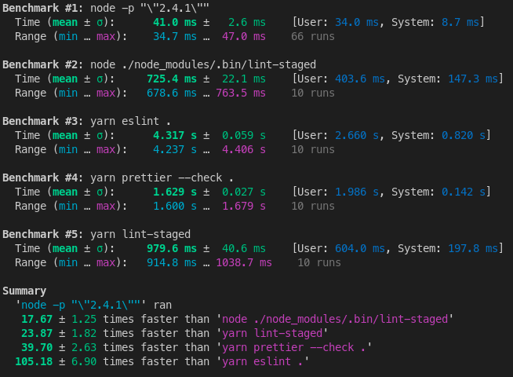

# Benchmarking NodeJS cli tools

| Command                                |      Mean [ms] | Min [ms] | Max [ms] |      Relative |
| :------------------------------------- | -------------: | -------: | -------: | ------------: |
| `node -p "\"2.4.1\""`                  |     40.6 ± 2.9 |     36.1 |     52.4 |          1.00 |
| `node ./node_modules/.bin/lint-staged` |   755.8 ± 23.8 |    715.0 |    787.4 |  18.61 ± 1.46 |
| `yarn eslint .`                        | 4351.2 ± 125.6 |   4170.9 |   4545.2 | 107.12 ± 8.28 |
| `yarn prettier --check .`              |  1604.9 ± 23.4 |   1571.0 |   1644.6 |  39.51 ± 2.89 |
| `yarn lint-staged`                     |   956.7 ± 46.5 |    879.0 |   1030.2 |  23.55 ± 2.04 |

Notes:

- `node -p "\"2.4.1\""` is the fastest we're ever going to get
  with nodejs @ ~40ms.
- Startup time of node scripts via yarn or npm is slower than running them
  directly with node. This adds a delay of ~200ms to any command just by choosing to
  use the convenience of npm scripts.
- Running `prettier` via `node ./node_modules/.bin/lint-staged` give us a 760ms
  pre-commit script. This is more than 5x faster than running eslint across the
  entire project.
